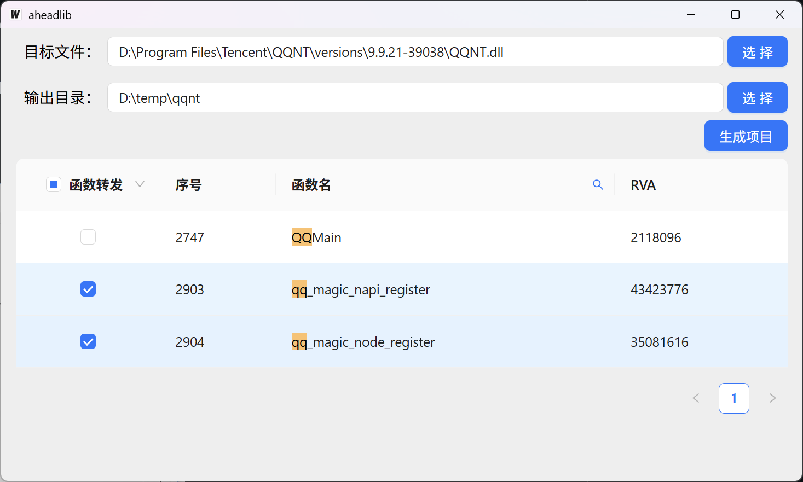
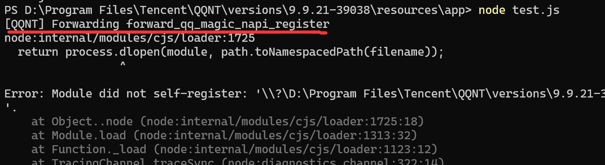
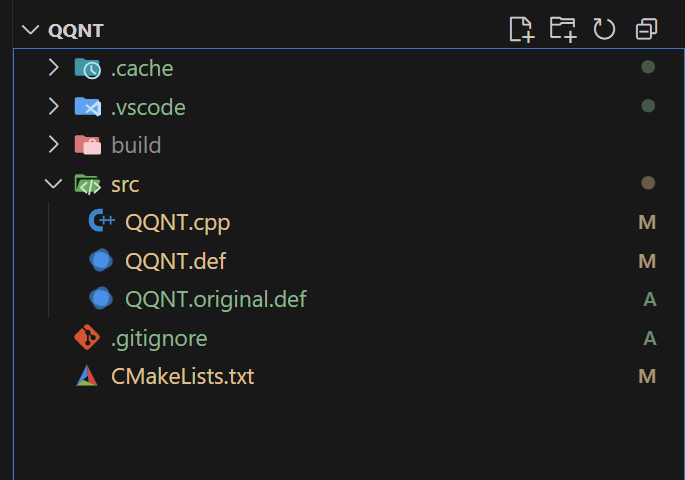

# AheadLib-CMake

使用 wails 开发，在其它AheadLib工具使用不顺手的情况下，根据自己实际需要而产生的工具。

## 说明

1. 打开程序
2. 选择目标文件`A.dll`和输出目录
3. 筛选函数名，选择是否需要使用“函数转发”
4. 点击生成项目
5. 编译项目，生成`A.dll`
6. 将原来的`A.dll`文件改名为`A.original.dll`
7. 将生成的`A.dll`放置于`A.original.dll`同目录下

> [!TIP]
> 没有启用“函数转发”，则直接把地址转发到`A.original.dll`；
>
> 启用“函数转发”，则会把地址转发到源代码中的`forward_xxx`函数；
> 
> 启用“函数转发”，你还需要手动修正每个函数对应`ExampleFunction_t`的参数以及返回值定义。

## 截图示例

## 相关项目

https://github.com/strivexjun/AheadLib-x86-x64

https://github.com/bodong1987/AHeadLib.Net